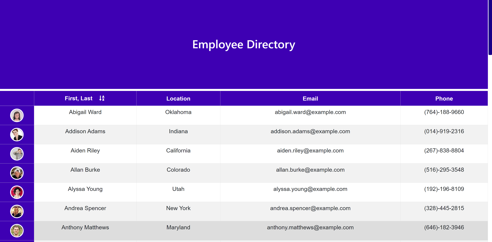

# Employee Directory

An employee database that allows coworkers to view contact info for the entire office.

## Table of Contents

- [Installation](#installation)
- [Usage](#usage)
- [Links](#Links)
- [Technologies](#Technologies)
- [License](#License)

## Installation

1. Download or clone repository
2. `npm install` to install the required npm packages to run

## Usage

- Application will be invoked by using the following command:

  `npm start`

- Open your browser and go to

  `http://localhost:3000`

- User can sort names from A - Z

- Table displays full name, state, email and phone number

## Links

- [Github](https://github.com/jongomezdev/Hardware-wallet)
- [Live Heroku App](https://hardware-wallet.herokuapp.com/)

## Technologies

- React
- Styled Components
- JavaScript

## License

This program is free software: you can redistribute it and/or modify
it under the terms of the GNU General Public License as published by
the Free Software Foundation, either version 3 of the License, or
(at your option) any later version.
This program is distributed in the hope that it will be useful,
but WITHOUT ANY WARRANTY; without even the implied warranty of
MERCHANTABILITY or FITNESS FOR A PARTICULAR PURPOSE.See the
GNU General Public License for more details.
You should have received a copy of the GNU General Public License
along with this program. If not, see <https://www.gnu.org/licenses/>

## Contributing

Open source, feel free to modify and change! Please share the results.

## Questions

Check out my other repositories in the link below:

- [GitHub Profile](https://github.com/jongomezdev)

- For any additional questions, please [email](mailto:jongomezdev@gmail.com) me.

## Demo

The following animation demonstrates the application functionality:

